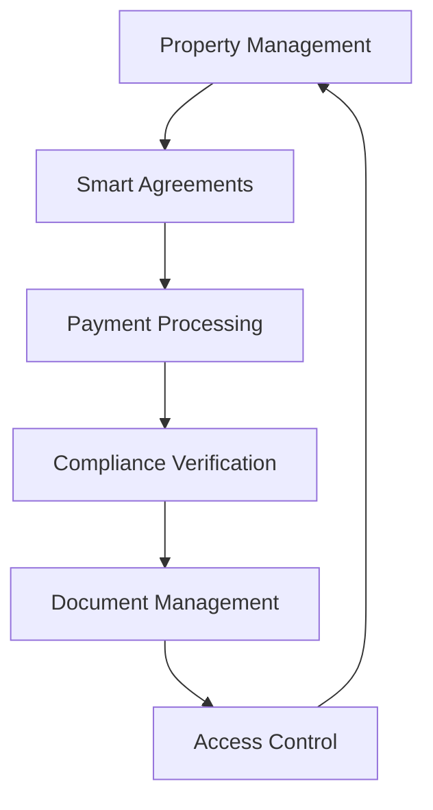

# Polish Real Estate Rental Management System Documentation

Welcome to the documentation for the Polish Real Estate Rental Management System. This documentation provides comprehensive information for both users and developers.

## Documentation Structure

```
docs/
├── README.md                 # This file
├── user/                     # User documentation
│   └── README.md            # User guide and workflows
├── technical/               # Technical documentation
│   └── README.md            # Architecture and API reference
├── polish-market-guide.md   # Polish rental market requirements
└── quick-start.md          # Getting started guide
```

## Documentation Overview

### [User Documentation](./user/README.md)
- System overview and key features
- User roles and permissions
- Step-by-step workflows
- Common scenarios
- Security best practices
- Troubleshooting guide

### [Technical Documentation](./technical/README.md)
- System architecture
- Smart contract system
- Contract interactions
- API reference
- Development setup
- Testing and deployment guides
- Extension guidelines

### [Polish Market Guide](./polish-market-guide.md)
- Legal framework
- Market requirements
- Compliance features
- Document requirements
- Payment regulations
- System features for compliance

### [Quick Start Guide](./quick-start.md)
- System access
- Common workflows
- Code examples
- Troubleshooting tips

## System Overview

The Polish Real Estate Rental Management System is a blockchain-based solution that handles:

- Property registration and management
- Rental agreement creation and management
- Payment processing (rent and deposits)
- Regulatory compliance verification
- Document management
- Access control

## Key Features



## Getting Started

1. Choose your role:
   - **Users**: Start with the [User Documentation](./user/README.md)
   - **Developers**: Begin with the [Technical Documentation](./technical/README.md)
   - **Quick Overview**: Check the [Quick Start Guide](./quick-start.md)
   - **Compliance**: Review the [Polish Market Guide](./polish-market-guide.md)

2. System Requirements:
   - Web3-compatible browser
   - MetaMask or similar wallet
   - For developers: Node.js v16+

## Support and Resources

- Technical Support: support@system.com
- Compliance Help: compliance@system.com
- Emergency Contact: emergency@system.com

## Contributing to Documentation

We welcome contributions to improve this documentation. Please follow these steps:

1. Fork the repository
2. Create a feature branch
3. Make your changes
4. Submit a pull request

## Documentation Updates

This documentation is regularly updated to reflect:
- System changes and improvements
- Regulatory requirement updates
- New features and capabilities
- User feedback and common questions

Last updated: April 24, 2025