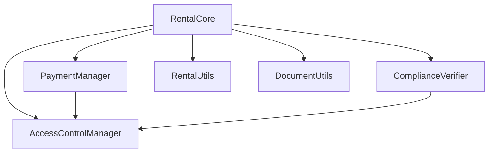
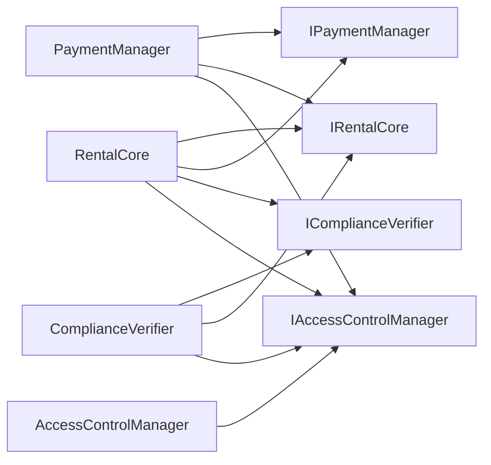
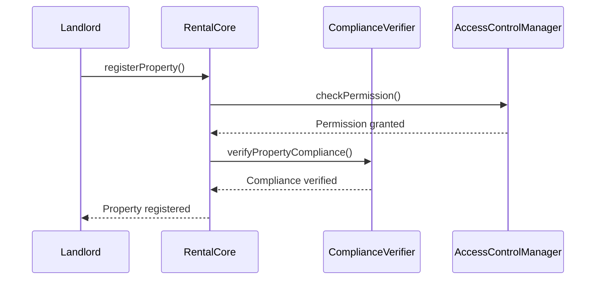
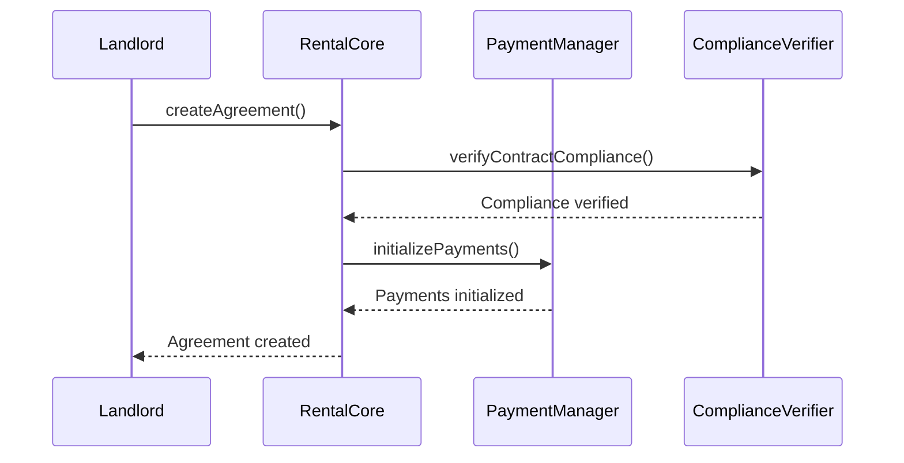

# Polish Real Estate Rental Management System - Technical Documentation

## Table of Contents
1. [Architecture Overview](#architecture-overview)
2. [Smart Contract System](#smart-contract-system)
3. [Contract Interactions](#contract-interactions)
4. [API Reference](#api-reference)
5. [Development Setup](#development-setup)
6. [Testing Guide](#testing-guide)
7. [Deployment Guide](#deployment-guide)
8. [Extension Guidelines](#extension-guidelines)

## Architecture Overview

The system implements a modular smart contract architecture with clear separation of concerns:



### Core Components

1. **RentalCore (RC)**
   - Main orchestration contract
   - Manages rental agreements and properties
   - Coordinates between other components
   - Implements core business logic

2. **PaymentManager (PM)**
   - Handles financial transactions
   - Manages deposits and rent payments
   - Calculates late fees
   - Tracks payment history

3. **ComplianceVerifier (CV)**
   - Ensures regulatory compliance
   - Verifies legal requirements
   - Manages document verification
   - Integrates with external oracles

4. **AccessControlManager (ACM)**
   - Implements role-based access control
   - Manages permissions
   - Handles user authorization
   - Controls system access

### Utility Libraries

1. **RentalUtils**
   - Rental calculations
   - Validation functions
   - Polish market specifics
   - Utility cost calculations

2. **DocumentUtils**
   - Document hashing
   - Verification functions
   - Digital signatures
   - Document ID generation

## Smart Contract System

### Contract Dependencies



### Security Features

- **ReentrancyGuard**: Prevents reentrancy attacks
- **Pausable**: Emergency shutdown capability
- **Access Control**: Role-based permissions
- **Safe Math**: Overflow protection
- **Input Validation**: Extensive parameter checking

## Contract Interactions

### Property Registration Flow



### Agreement Creation Flow



## API Reference

### RentalCore

```solidity
function registerProperty(bytes32 dataHash) external returns (uint256)
function createAgreement(uint256 propertyId, address tenant, bytes32 terms, uint256 startDate, uint256 endDate, uint256 rentAmount, uint256 depositAmount) external returns (uint256)
function terminateAgreement(uint256 agreementId) external
function updateAgreementStatus(uint256 agreementId, uint8 status) external
function getPropertyDetails(uint256 propertyId) external view returns (address owner, bytes32 dataHash, bool isActive)
function getAgreementDetails(uint256 agreementId) external view returns (uint256 propertyId, address landlord, address tenant, uint256 startDate, uint256 endDate, uint256 rentAmount, uint256 depositAmount, uint8 status, bytes32 termsHash)
```

### PaymentManager

```solidity
function processRentPayment(uint256 agreementId) external payable returns (bool)
function processDeposit(uint256 agreementId) external payable returns (bool)
function releaseDeposit(uint256 agreementId, uint256 amount, address payable recipient) external returns (bool)
function getPaymentHistory(uint256 agreementId) external view returns (uint256[] memory timestamps, uint256[] memory amounts, uint8[] memory types)
function calculateOutstandingRent(uint256 agreementId) external view returns (uint256 amount, uint256 lateFees)
```

### ComplianceVerifier

```solidity
function verifyContractCompliance(uint256 agreementId) external returns (bool passed, bytes32 detailsHash)
function verifyLandlordCompliance(address landlordAddress) external returns (bool passed, bytes32 detailsHash)
function verifyTenantCompliance(address tenantAddress) external returns (bool passed, bytes32 detailsHash)
function updateComplianceParameters(bytes32 parametersHash) external returns (bool)
```

### AccessControlManager

```solidity
function assignRole(address account, bytes32 role) external returns (bool)
function revokeRole(address account, bytes32 role) external returns (bool)
function grantPermission(address account, bytes32 permission) external returns (bool)
function revokePermission(address account, bytes32 permission) external returns (bool)
function hasPermission(address account, bytes32 permission) external view returns (bool)
```

## Development Setup

### Prerequisites

- Node.js v16+
- Hardhat
- OpenZeppelin Contracts
- Ethers.js

### Installation

```bash
# Clone repository
git clone [repository-url]

# Install dependencies
npm install

# Copy environment file
cp .env.example .env

# Configure environment variables
# Edit .env with appropriate values
```

### Build and Test

```bash
# Compile contracts
npx hardhat compile

# Run tests
npx hardhat test

# Run specific test file
npx hardhat test test/RentalCore.test.ts
```

## Testing Guide

### Test Structure

- Unit tests for each contract
- Integration tests for contract interactions
- Compliance tests for Polish regulations
- Security tests for access control

### Running Tests

```bash
# Run all tests
npm test

# Run specific test suite
npm test -- --grep "RentalCore"

# Run with coverage
npm run coverage
```

## Deployment Guide

### Deployment Process

1. Configure deployment environment
2. Deploy AccessControlManager
3. Deploy ComplianceVerifier
4. Deploy PaymentManager
5. Deploy RentalCore
6. Set up contract relationships
7. Verify contract deployment
8. Run post-deployment validation

### Using Hardhat Ignition

```bash
# Deploy to local network
npx hardhat ignition deploy ./ignition/modules

# Deploy to testnet
npx hardhat ignition deploy ./ignition/modules --network goerli

# Deploy to mainnet
npx hardhat ignition deploy ./ignition/modules --network mainnet
```

## Extension Guidelines

### Adding New Features

1. Create new interface
2. Implement contract
3. Add tests
4. Update deployment scripts
5. Document changes

### Modifying Existing Contracts

1. Review dependencies
2. Implement changes
3. Update tests
4. Verify compliance
5. Document updates

### Security Considerations

- Follow Solidity best practices
- Use latest compiler version
- Implement access controls
- Add comprehensive tests
- Conduct security audit