# Smart Contract Architecture for Polish Real Estate Rental Management System

## 1. Overall Architecture

The architecture follows a modular design with clear separation of concerns, focusing on payment processing and contract verification on-chain while keeping most operational data off-chain.

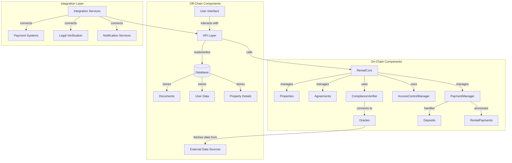

## 2. Core Smart Contracts

### 2.1 RentalCore Contract

This is the main entry point for the system, orchestrating interactions between other contracts.

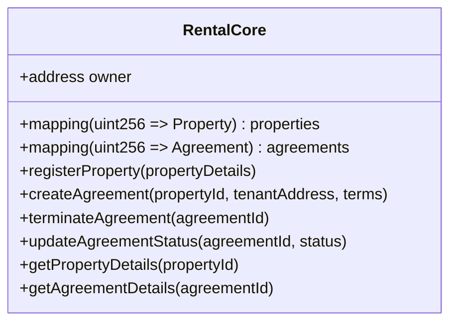

### 2.2 Property Contract

Represents real estate properties in the system.

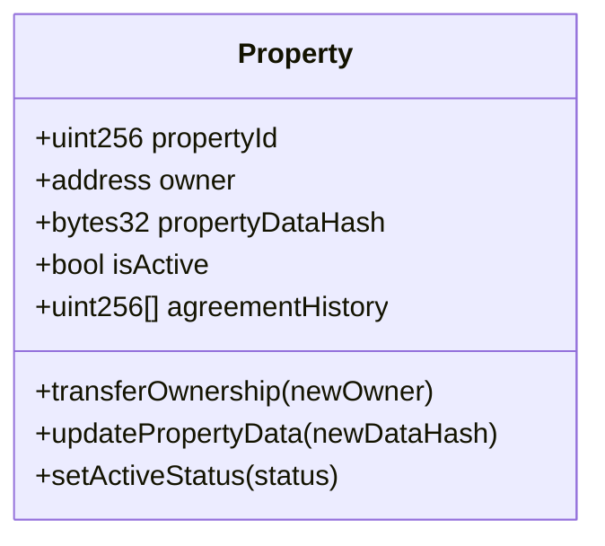

### 2.3 Agreement Contract

Manages rental agreements between landlords and tenants.

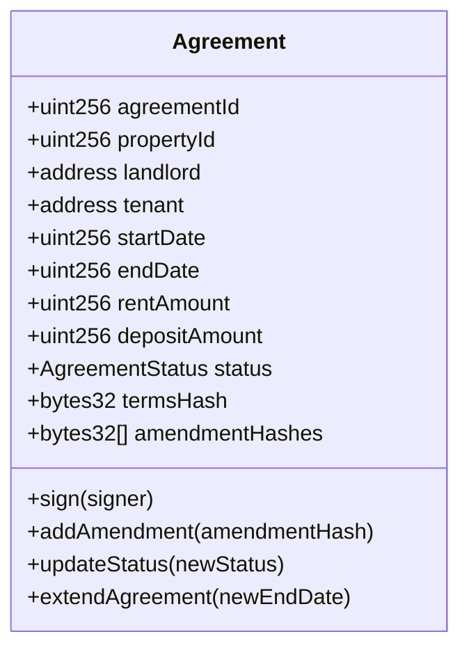

### 2.4 PaymentManager Contract

Handles all payment-related functionality.

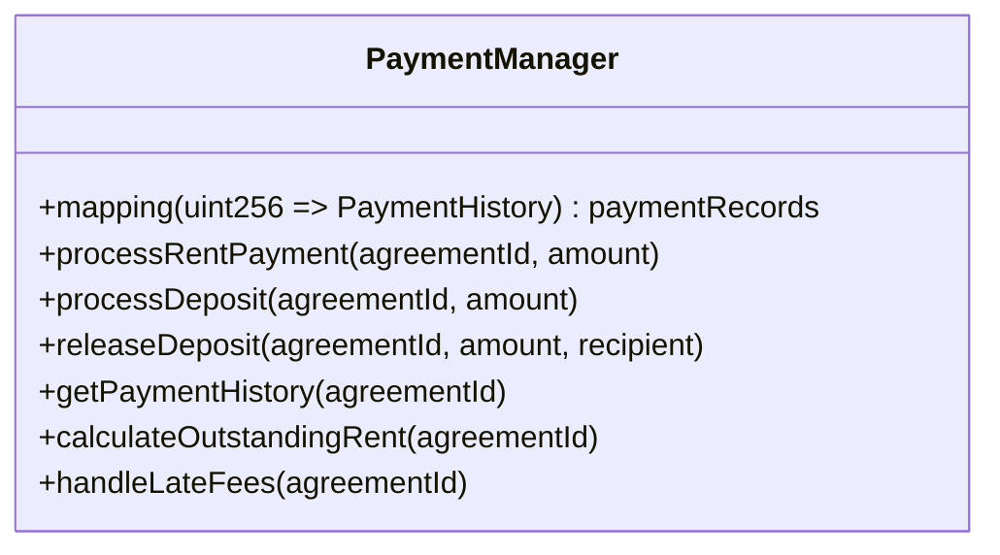

### 2.5 AccessControlManager Contract

Manages permissions and access control.

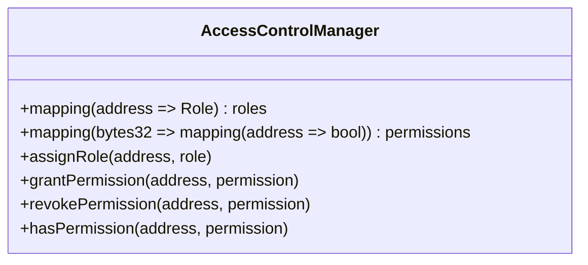

### 2.6 ComplianceVerifier Contract

Ensures compliance with Polish real estate laws and regulations.

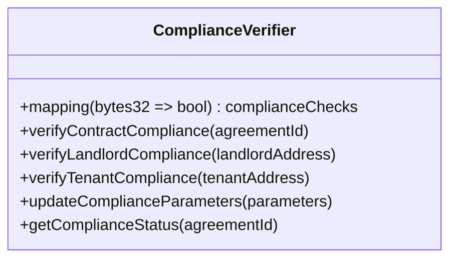

### 2.7 Oracle Integration Contract

Interfaces with external data sources for compliance verification.

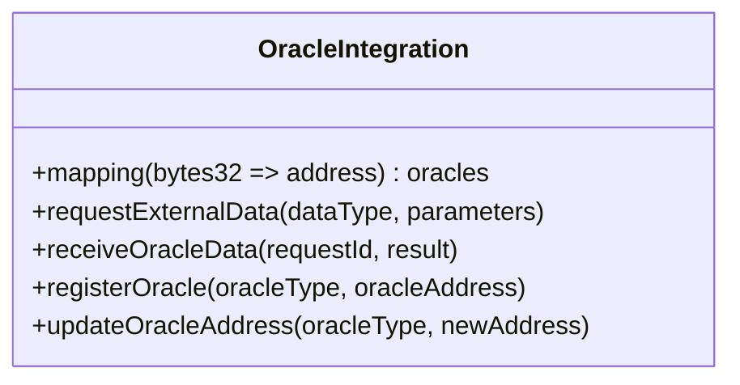

## 3. Data Model for On-Chain Storage

The on-chain data model will be minimal, focusing only on essential data needed for contract verification and payment processing.

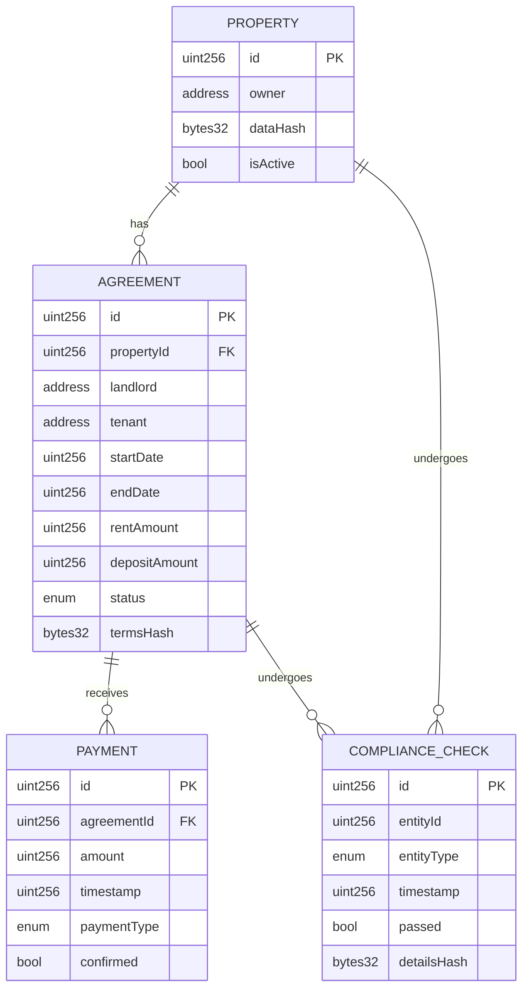

## 4. Access Control and Permission System

The system will implement a role-based access control system with the following roles and permissions:

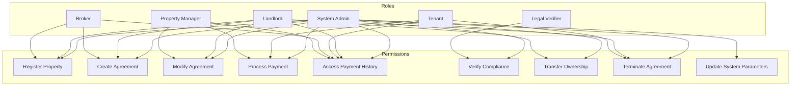

## 5. Upgrade Mechanisms

The architecture will implement the following upgrade mechanisms to allow for future modifications:

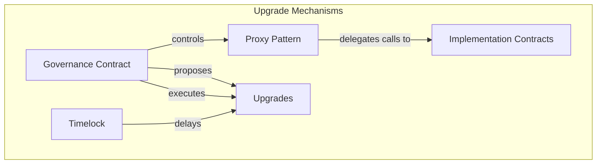

1. **Proxy Pattern**: All core contracts will be deployed behind proxies to allow for upgrades without changing contract addresses.
2. **Governance Contract**: A dedicated governance contract will manage the upgrade process.
3. **Timelock Mechanism**: Upgrades will be subject to a timelock period to allow users to review changes.
4. **Emergency Pause**: Critical functions can be paused in case of emergencies.

## 6. Integration with Off-Chain Systems

The architecture will include the following integration points with off-chain systems:

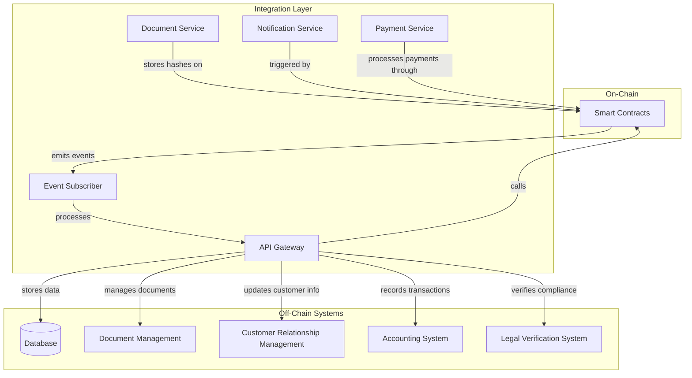

## 7. Handling Edge Cases

The architecture will address the identified edge cases as follows:

### 7.1 Payment-Related Edge Cases

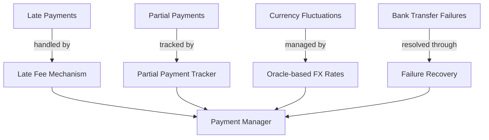

### 7.2 Property-Related Edge Cases

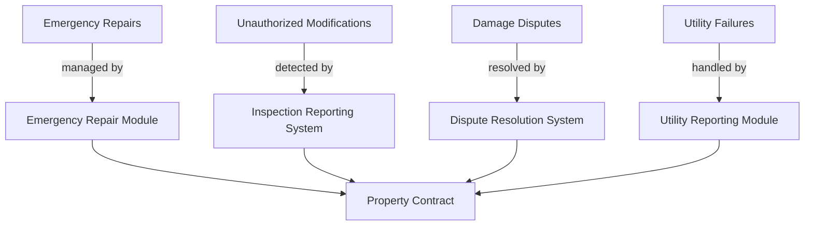

### 7.3 Tenant-Related Edge Cases

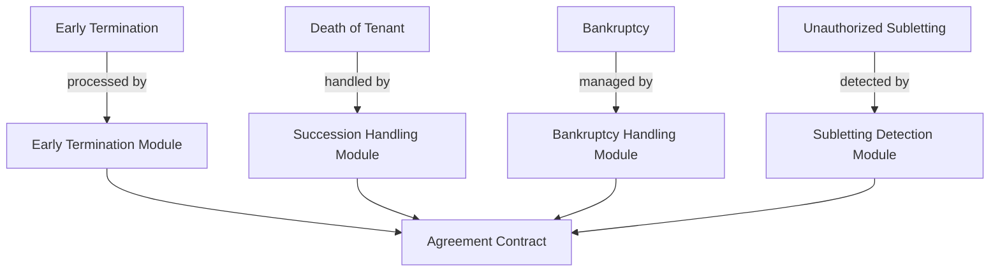

### 7.4 Legal-Related Edge Cases

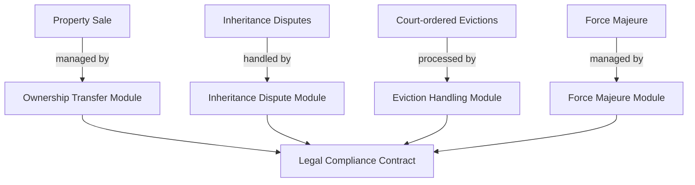

## 8. Implementation Considerations

### 8.1 Gas Optimization

1. **Minimal On-Chain Data**: Store only essential data on-chain
2. **Batched Operations**: Implement batching for multiple operations
3. **Gas-Efficient Data Structures**: Use appropriate data structures to minimize gas costs
4. **Event-Based Architecture**: Use events for off-chain systems to track changes

### 8.2 Security Measures

1. **Multi-Signature Requirements**: Critical operations require multiple signatures
2. **Access Control**: Strict role-based access control
3. **Circuit Breakers**: Emergency pause functionality
4. **Rate Limiting**: Prevent spam attacks
5. **Formal Verification**: Critical contracts should undergo formal verification

### 8.3 Oracle Integration

1. **Chainlink Integration**: For reliable external data
2. **Multiple Oracle Sources**: To prevent single points of failure
3. **Data Validation**: Validate oracle data before use
4. **Fallback Mechanisms**: In case of oracle failures

## 9. Deployment Strategy

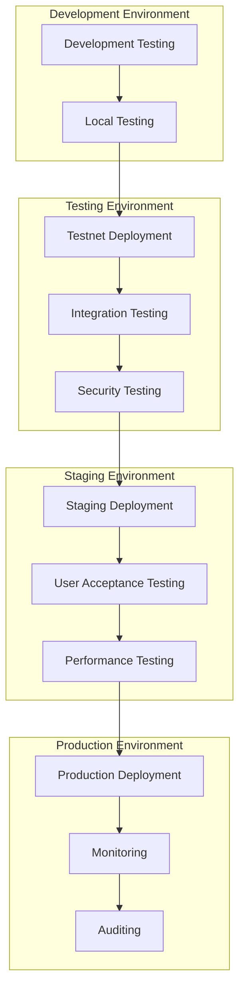

## 10. Broker-Specific Features

### 10.1 Portfolio Management

- Multiple property tracking through the Property contract
- Occupancy status monitoring via Agreement status
- Revenue analytics through PaymentManager records
- Commission calculation based on successful agreements

### 10.2 Document Management

- Automated contract generation using templates and on-chain data
- Digital signature integration for agreement signing
- Document verification system using hash comparison
- Compliance checking through the ComplianceVerifier

### 10.3 Financial Tools

- Automated payment processing via PaymentManager
- Commission distribution to brokers upon successful agreements
- Tax calculation based on payment records
- Financial reporting using aggregated payment data

### 10.4 Client Management

- Client verification system through KYC integration
- Communication platform via off-chain systems
- Viewing schedule management for property showings
- Rating system for landlords, tenants, and properties

## 11. Compliance Verification with Oracle Integration

The ComplianceVerifier contract will integrate with oracles to verify compliance with Polish real estate laws and regulations:

### 11.1 Compliance Verification Checkpoints

1. **Agreement Creation**: Verify that the agreement terms comply with Polish rental laws
2. **Landlord Verification**: Verify landlord's ownership and legal status
3. **Tenant Verification**: Verify tenant's identity and legal status
4. **Payment Processing**: Verify compliance with payment regulations
5. **Agreement Termination**: Verify compliance with termination procedures

### 11.2 Oracle Integration

1. **Legal Database Oracle**: Provides updates on relevant laws and regulations
2. **Property Registry Oracle**: Verifies property ownership and status
3. **Identity Verification Oracle**: Verifies identity of landlords and tenants
4. **Tax Authority Oracle**: Verifies tax compliance
5. **Court Records Oracle**: Checks for relevant legal proceedings

### 11.3 Implementation

```mermaid
sequenceDiagram
    participant User
    participant SC as Smart Contract
    participant OC as Oracle Contract
    participant DS as Data Source
    
    User->>SC: Request Compliance Verification
    SC->>OC: Request External Data
    OC->>DS: Query Data Source
    DS->>OC: Return Data
    OC->>SC: Provide Verified Data
    SC->>User: Return Compliance Status